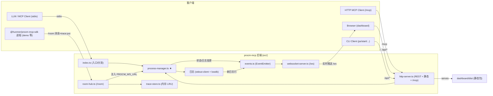

# procm-mcp

一个用于**进程管理**的 Model Context Protocol (MCP) 服务器。让 LLM 与人类操作者通过统一接口启动、监控、重启、停止子进程，写入其 stdin 或发送信号，并读取其 stdout/stderr 日志。在此之上提供两个子域：**房间**（被管进程经 WebSocket `/room` 互发消息与结构化日志，SDK 为 `@hunmer/procm-mcp-sdk`）与**追踪**（SDK hook 捕获函数调用存内存 LRU，经 `trace-get` 读取）。纯 Node.js + TypeScript（ESM），前端 dashboard 是独立的 React + Vite 工程。

后端有三种形态（stdio MCP / `--server` HTTP 后端 / CLI 客户端）共享同一套模块级状态，并额外在 HTTP 端口暴露 stateless 的 `/mcp` 端点与一个仅绑定 `127.0.0.1` 的 dashboard（经 WebSocket `/ws` 实时推送进程状态与日志）。进程历史持久化到 `processes.json`，跨重启可见。**进程启动没有任何白名单/审批门控**：`start-process` / `procm-command` 直接执行给定命令，应像对待任意 shell 命令一样保留人工确认。

技术栈：Node.js（ESM/Node16）、`@modelcontextprotocol/sdk`、`zod`、`lowdb`、`tree-kill`、`ws`、`nanoid`、`lru-cache`；房间协议与 SDK 见 `packages/procm-sdk/`。

## 约定（高优先级）

- 改 TS 源码后**必须 `npm run build`**（= `build:sdk` → `sync:demos` → `build:dashboard` → `tsc`）——运行入口是 `build/index.js`。改 SDK 源码同理（后端消费 `packages/procm-sdk/dist`）。
- 源码 import **必须带 `.js` 后缀**（Node16 ESM），即使源文件是 `.ts`。
- 新增 MCP 工具要在 `index.ts`（stdio，14 工具）**和** `mcp-http.ts` 的 `registerAllTools`（HTTP `/mcp`，13 工具）两处都注册——当前唯一差异是 `process-input` 仅 stdio。
- 进程能力统一在 `src/process-manager.ts`，MCP 工具层与 HTTP 层都调它；新增进程状态/日志变更记得 `dashboardEvents.emitProcessChange()`/`emitLog()` 以驱动 WS 推送。
- room/trace 协议以 `packages/procm-sdk/src/protocol.ts` 为单一事实源（后端 `room-hub.ts` import 它），改协议先改 SDK 并重编。
- stdio 模式下**不要往 stdout 打业务日志**（stdout 是协议通道），用 `serverLog()` 或 `console.error`。
- 本仓服务进程由全局 `procm-mcp` 经 `procm-commands.json` 统一管理，调试前先读 [debug.md](debug.md)。

详见 [claude/conventions.md](claude/conventions.md)。

## 文件索引

| 文件 | 用途 | 何时阅读 |
|---|---|---|
| [claude/overview.md](claude/overview.md) | 架构总览、运行形态、关键设计取舍 | 第一次理解项目时 |
| [claude/conventions.md](claude/conventions.md) | 构建/测试命令、代码风格、禁止事项、新增工具检查清单 | 改代码前 |
| [claude/module-responsibilities.md](claude/module-responsibilities.md) | 每个 `src/*.ts` 文件的职责与分层 | 定位实现时 |
| [claude/entrypoints.md](claude/entrypoints.md) | 入口、模式启动流程、信号处理、构建 | 理解启动与生命周期时 |
| [claude/public-interfaces.md](claude/public-interfaces.md) | MCP 工具、REST API、CLI 子命令、procm-commands.json | 对接接口时 |
| [claude/dependencies-and-config.md](claude/dependencies-and-config.md) | 依赖、配置文件、环境变量、运行时数据落点 | 排查环境/依赖时 |
| [claude/data-model.md](claude/data-model.md) | ProcessMetadata、状态机、日志/历史持久化 | 改进程或日志逻辑时 |
| [claude/testing-and-quality.md](claude/testing-and-quality.md) | 测试命令、自建框架、覆盖情况、质量风险 | 写测试/评估质量时 |
| [claude/file-map.md](claude/file-map.md) | 目录树 + 关键文件定位速查 | 找文件时 |
| [claude/faq.md](claude/faq.md) | 常见问题与定位路径 | 踩坑时 |
| [claude/changelog.md](claude/changelog.md) | 本索引的生成/更新记录 | 查文档版本时 |

## 模块索引

| 模块 | 职责摘要 | 入口 |
|---|---|---|
| 根后端（`src/`） | MCP 服务器（14 工具）+ HTTP 后端 + CLI 客户端 + 进程/日志/房间/追踪领域核心 + WS 双端点 | `src/index.ts` |
| procm-sdk（`packages/procm-sdk/`） | `@hunmer/procm-mcp-sdk`：房间客户端、结构化日志、函数 hook/trace、custom-execution RPC | `packages/procm-sdk/src/index.ts` |
| dashboard（`dashboard/`） | React + Vite + coss 的 Web UI，经 WebSocket 实时推送 + 同源 REST 管理进程（含系统进程 Tab、i18n） | `dashboard/src/main.tsx` |

## 扫描状态

- **更新时间**：2026-08-25
- **已扫描**：8-17 全量基线之上的增量重扫（经 `git diff 687a2b8..HEAD` 定位）：`src/` 全部变更文件（`http-server`、`logger`、`index`、`mcp-http`、`websocket-server`、`events`、`process-manager`、`tools/process-logs`、`tools/api-operations`）、`tests/`（run-all 现 13 套 + 新增 `log-clear-notification`/`native-directory`/`spawn-target`）、`api-changes.md`（8-18/8-20/8-25 三批 API 变更）；dashboard `src/` 全量细读（四 Tab、组件子目录化、favorites 服务端化、playground，见 `dashboard/CLAUDE.md`）；SDK `rest.ts` 8-20 的 `clearLogs` 增量。
- **跳过**：`build/`、`node_modules/`、各 `dist`（产物/依赖）；`dashboard/src/registry/default/ui/*`（vendored coss 组件）；`.agents/` `.codex/` `.zcode/` `.github/`（agent/CI 配置）；`demo/`、`scripts/`、`documents/`、`examples/`、`handoff/`（按需浏览，已入 file-map）。
- **下一步建议**：dashboard `NewProcessDialog`/`LogFilesView`/`ImportGroupDialog` 仍为结构级扫描；`playground/catalog.ts` 与后端路由表人工同步有漂移风险；进程 `.log` 仍无大小上限；补纯函数单测。详见 [claude/changelog.md](claude/changelog.md)。
