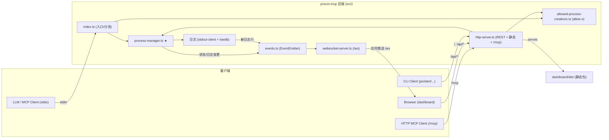

# procm-mcp

一个用于**进程管理**的 Model Context Protocol (MCP) 服务器。让 LLM 与人类操作者通过统一接口启动、监控、重启、停止子进程，并读取其 stdout/stderr 日志。纯 Node.js + TypeScript（ESM），前端 dashboard 是独立的 React + Vite 工程。

核心是 **allow-x 模式**：模型要启动进程，须先用 `allowed-process`（action `allow`）把「script+args+cwd」三元组加入白名单（此步需人类确认），之后相同三元组即可免确认执行——以此在安全与易用之间取得平衡。后端有三种形态（stdio MCP / `--server` HTTP 后端 / CLI 客户端）共享同一套模块级状态，并额外在 HTTP 端口暴露 stateless 的 `/mcp` 端点与一个仅绑定 `127.0.0.1` 的 dashboard（经 WebSocket `/ws` 实时推送进程状态与日志）。进程历史持久化到全局 `processes.json`，跨重启可见。

技术栈：Node.js（ESM/Node16）、`@modelcontextprotocol/sdk`、`zod`、`lowdb`、`tree-kill`、`ws`、`nanoid`。

## 约定（高优先级）

- 改 TS 源码后**必须 `npm run build`**（= 先 `build:dashboard` 再 `tsc`；**无独立 `build:all`**）——运行入口是 `build/index.js`。
- 源码 import **必须带 `.js` 后缀**（Node16 ESM），即使源文件是 `.ts`。
- 新增 MCP 工具要在 `index.ts` **和** `mcp-http.ts` 的 `registerAllTools` 两处都注册。
- 进程能力统一在 `src/process-manager.ts`，MCP 工具层与 HTTP 层都调它；新增进程状态/日志变更记得 `dashboardEvents.emitProcessChange()`/`emitLog()` 以驱动 WS 推送。
- stdio 模式下**不要往 stdout 打业务日志**（stdout 是协议通道），用 `serverLog()` 或 `console.error`。
- allow-x 只守 LLM 路径（`start-process`/`procm-command`）；dashboard/CLI 的人类驱动启动故意绕过。
- 实时推送：进程状态/日志经 `events.ts`（EventEmitter）→ `websocket-server.ts` → dashboard；进程状态变更在微任务内合并。

详见 [claude/conventions.md](claude/conventions.md)。

## 文件索引

| 文件 | 用途 | 何时阅读 |
|---|---|---|
| [claude/overview.md](claude/overview.md) | 架构总览、运行形态、关键设计取舍 | 第一次理解项目时 |
| [claude/conventions.md](claude/conventions.md) | 构建/测试命令、代码风格、禁止事项、新增工具检查清单 | 改代码前 |
| [claude/module-responsibilities.md](claude/module-responsibilities.md) | 每个 `src/*.ts` 文件的职责与分层 | 定位实现时 |
| [claude/entrypoints.md](claude/entrypoints.md) | 入口、三模式启动流程、信号处理、构建/CI | 理解启动与生命周期时 |
| [claude/public-interfaces.md](claude/public-interfaces.md) | 5 个 MCP 工具、REST API、CLI 子命令、procm-commands.json | 对接接口时 |
| [claude/dependencies-and-config.md](claude/dependencies-and-config.md) | 依赖、配置文件、环境变量、运行时数据落点 | 排查环境/依赖时 |
| [claude/data-model.md](claude/data-model.md) | ProcessMetadata、状态机、日志/白名单持久化 | 改进程或日志逻辑时 |
| [claude/testing-and-quality.md](claude/testing-and-quality.md) | 测试命令、自建框架、覆盖情况、质量风险 | 写测试/评估质量时 |
| [claude/file-map.md](claude/file-map.md) | 目录树 + 关键文件定位速查 | 找文件时 |
| [claude/faq.md](claude/faq.md) | 常见问题与定位路径 | 踩坑时 |
| [claude/changelog.md](claude/changelog.md) | 本索引的生成/更新记录 | 查文档版本时 |

## 模块索引

| 模块 | 职责摘要 | 入口 |
|---|---|---|
| 根后端（`src/`） | MCP 服务器 + HTTP 后端 + CLI 客户端 + 进程/日志/allow-x 领域核心 + WS 实时推送 | `src/index.ts` |
| dashboard（`dashboard/`） | React + Vite + coss 的 Web UI，经 WebSocket 实时推送 + 同源 REST 管理进程 | `dashboard/src/main.tsx` |

## 扫描状态

- **更新时间**：2026-08-01
- **已扫描**：后端 `src/`（25 文件，含新增 `events.ts`/`websocket-server.ts`/`processes-repository.ts`/`project-scanner.ts` + `tools/` 4 文件）、`tests/`（6 套 + helpers + 资源）、`scripts/`（含 `demo/`）、根配置（package/tsconfig/server.json/.mcp.json/.gitignore/publish.yml）、dashboard `src/`（8 组件 + 7 lib 文件）与配置。
- **跳过**：`build/`、`node_modules/`、`dashboard/dist`、`dashboard/node_modules`（产物/依赖）；`dashboard/src/registry/default/ui/*`（22 个 vendored coss 组件，已归纳来源用法）；`.agents/` `.codex/` `.zcode/` `.claude/`（agent 工具配置，非项目源码）。
- **下一步建议**：补单元测试覆盖纯函数（`validateScript`/白名单匹配/`project-scanner`）；评估日志轮转；核实 `.mcp.json` 示例 `--secure` 与实现一致性；dashboard REST 客户端支持 token 注入。详见 [claude/changelog.md](claude/changelog.md)。
